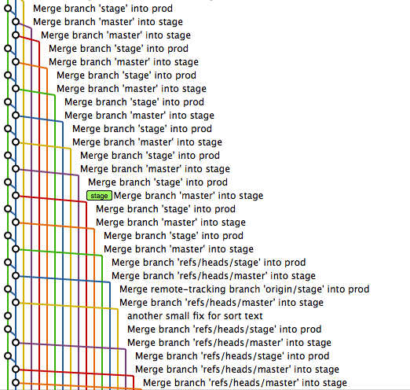

# A Rebasing Workflow

@emmajanehw

www.gitforteams.com


# Agenda

- tl;dr on rebasing
- **Rant** why I _hate_ rebasing
- **Rave** why I _love_ rebasing
- Wrap-up
- Q&A


# tl;dl

(too long; didn't listen)


## What is Rebasing?


### Official Definition

Forward-port local commits to the updated upstream head.


### English (ish) Definition

Move my branch-specific commits to a new branch tip.


### The Outcome -- English (ish)

Incorporate upstream work without leaving a merge commit.


## What is **Interactive Rebasing**?

**Normal rebasing:** replay a sequence of commits.

**Interactive rebasing:** replay a sequence of commits <br/>while _optionally_ changing each commit.


### Make History Easier to Read by **Squashing** Related Commits into Whole Ideas


### Simplify History by **Editing** Unrelated Commits into Discrete Ideas


## Why the Fuss?<br />Because TIMTOWTDI

- `pull` => `fetch` + `merge`
- `merge --no-ff` => forces a merge commit object (“true merge”)
- `merge --ff-only` => fast forward (graph looks like rebase)
- `merge --squash` => compress commits to one; then merge
- `rebase` => forward-port local commits
- `cherry-pick` => merge individual commits

NOTE: Pull request => fetch + merge with no fast forwards. Creates a merge commit. Often completed on a remote system with a one-click button. Forcing you into whatever workflow the UI has created for you. No flexibility! Merge request => setup the incoming work as a remote; review it locally; and then merge in the branch (or rebase!) however you would like. More steps to setup, but more control over how the work looks in the history graph.


### Should I Use `merge` or `rebase`?

I will love you regardless of which strategy you use.

(But your team *might* not.)


### Merging to **Update** is "Messy"


### Merge Commits to **Combine** are "Messy"




NOTE: Compare graphs from merge and rebase


## HOWTO...


### ... Incorporate Upstream Work?

````
$ git pull --rebase=preserve master
$ git checkout my_local_branch
$ git rebase master
````


### ... Manipulate a Series of Commits?

````
$ git checkout my_local_branch
$ git rebase --interactive [commit]
````

Choose from the following options:

- `pick`: leave as-is (default)
- `edit`: separate commit into several discrete commits
- `squash`: combine commits
- delete: remove line referencing commit(s)
- re-order: change the order of the lines


### ... Stop Rebasing?

- If things go right, it will stop on its own.
- If there are tears, you can abort the process:

````
$ git rebase --abort
````


### ... Resolve a Conflict Once and for All?

Turn on REuse REcorded REsolution permanently:
````
$ git config --global rerere.enabled true
````

Forget a bad resolution:
````
$ git rerere forget
````

Remember a good resolution:
````
$ git rerere
````


# &lt;/tl;dl&gt;


# Rant

Why I don't like rebasing.


## Historical Revisionism


## Git is Commit-Aware;<br />Not Branch Aware


Note: Git is commit-aware. Not Branch aware. That means every single commit is always visible. Nothing is collapsible in the default UIs. Information about parents are retained, sort of, but you have to do your merges in a very specific way to take advantage of it.


## Compare: Bazaar is branch aware.


# Rave

Why I love rebasing.


## Make Whole Thoughts

**The Commit Object**

- Is just the right size.
- Contains only related code.
- Conforms to coding standards.

Resources: [gitforteams.com/resources/commit-granularity.html](http://gitforteams.com/resources/commit-granularity.html)

Note: Reshape your personal work history to reflect a whole idea before sharing it with others. This essentially mimics the creation of a patch. Rebasing also allows you to tease apart multiple ideas from a single commit and separate them into two different commits.


## Convert Conversations to Conclusions

aka: make patches from pull requests

Note: With a Web-based interface, we’re now seeing a lot more conversations happen alongside the code, with tiny commits and adjustments along the way. Previously this conversation might have happened in a mailing list, with patches attached. Same conversation, but the patches reflected whole “conclusions” up to that point. There were no micro commits in the repository history. In other words, when we moved to a web-based system with conversations, we essentially switched from conclusion-based commits to conversation artefacts.


# Summary

- The benefits of rebasing are most apparent to projects with multiple branches and multiple committers.
- Rebasing allows you to reshape commit history so that you are storing conclusions, not conversations.
- Rebasing can be used in place of merge to update a branch and results in a simplified graph of your repository history.
- Rebasing can be used interactively to reshape a series of commits.


## www.gitforteams.com

Emma Jane Hogbin Westby

@emmajanehw

![book cover]
![video cover]
